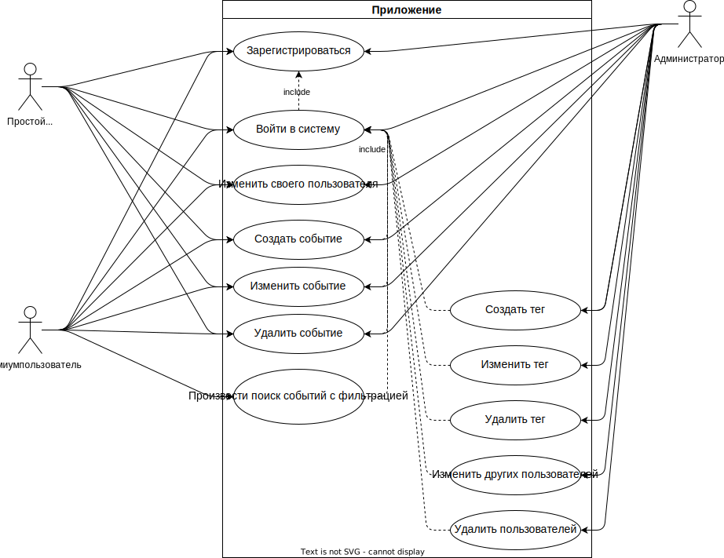
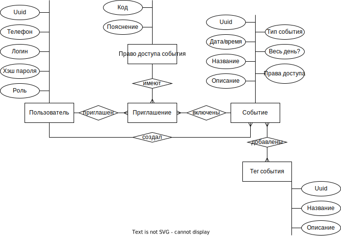
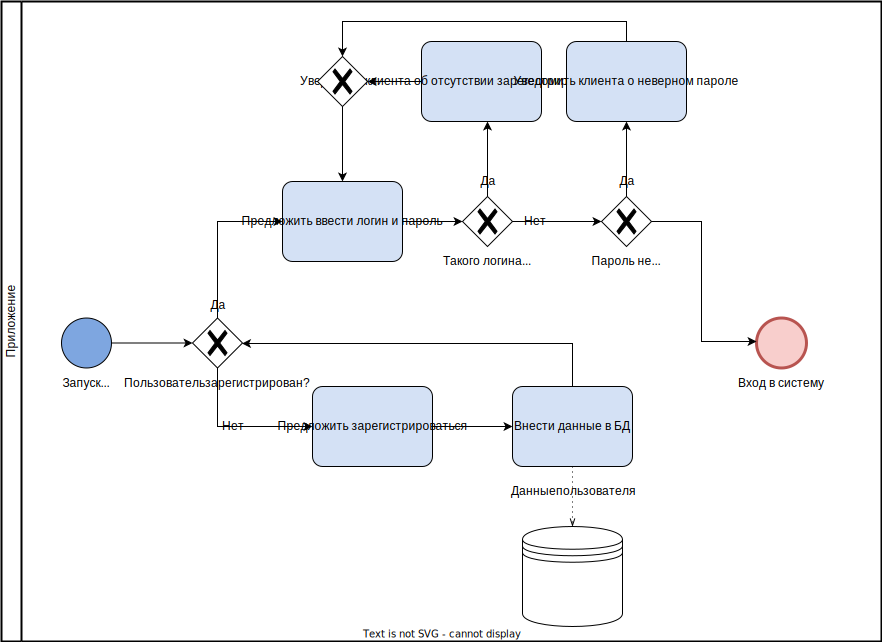
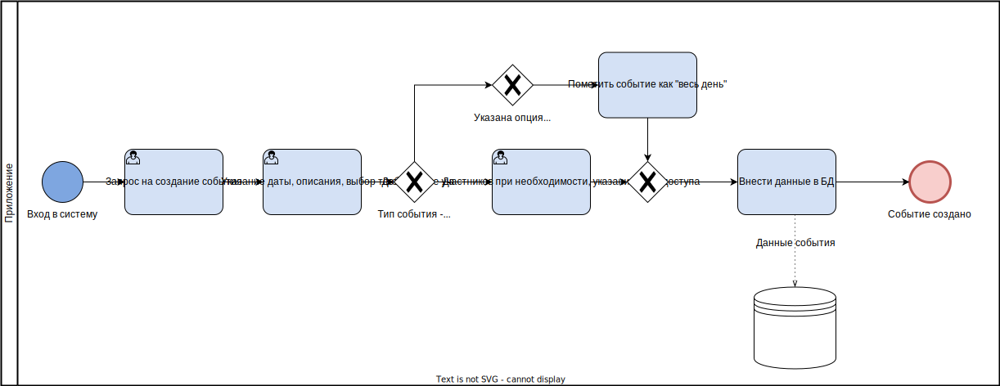
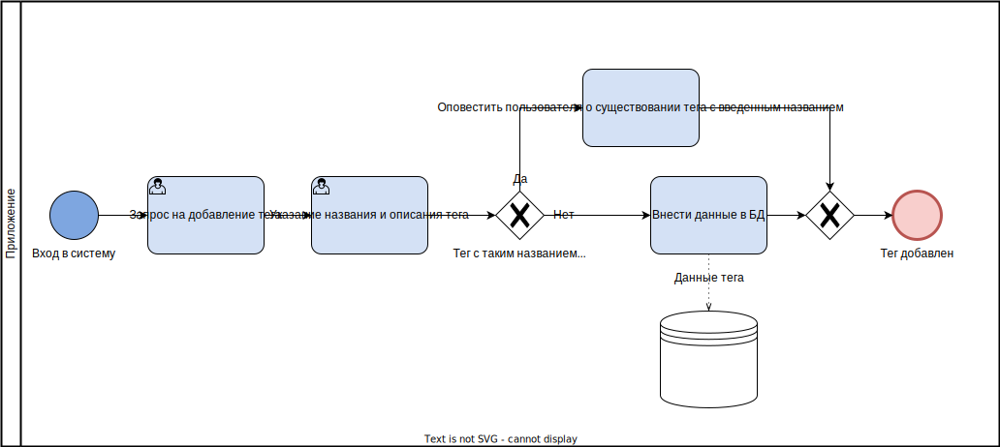

# Многопользовательский календарь

---

## Краткое описание идеи проекта

Разработка приложения, представляющего собой календарь с необходимостью авторизации. Пользователи могут создавать события и добавлять к ним участников. Также события можно менять и удалять. Реализовать возможность гибкого поиска по разным характеристикам событий.

## Краткое описание предметной области

Описанное приложение предоставляет возможность составлять личное расписание, создавать заметки с использованием даты/времени, добавлять напоминания и планировать встречи. В зависимости от выставленных ограничений на событие, приглашенные пользователи могут просматривать, менять событие или приглашать других пользователей.

## Краткий анализ аналогичных решений

| Название приложения | Возможность добавлять участников | Возможность гибкой настройки прав доступа | Возможность добавлять теги | Возможность поиска событий |
| :------------------ | -------------------------------- | ----------------------------------------- | -------------------------- | -------------------------- |
| Яндекс.Календарь    | +                                | +/-                                       | -                          | -                          |
| Календарь Outlook   | +                                | -                                         | +                          | +/-                        |
| Календарь Google    | +                                | +                                         | +/-                        | +                          |

## Краткое обоснование целесообразности и актуальности проекта

Планирование является неотъемлемым процессом, который все выполняют каждый день. В связи с этим растет актуальность приложений, упрощающих этот процесс. Как видно из сравнения, у всех ныне существующих решений присутствуют недостатки: недостаточна гибкая система прав доступа, отсутствие тегов или возможности поиска и их использованием. Поэтому актуальность проекта заключается в создании приложения, предоставляющего все выше описанные возможности.

## Use-Case

## ER-диаграмма сущностей

## Пользовательские сценарии

1. Зарегистрироваться
2. Авторизоваться и создать событие
3. Авторизоваться и редактировать событие
4. Авторизоваться и удалить событие
5. Авторизоваться и создать тег
6. Авторизоваться и редактировать тег
7. Авторизоваться и удалить тег
8. Авторизоваться и произвести поиск событий с фильтрацией

## Формализация бизнес-правил

Ниже приведена формализация нескольких основных бизнес-правил.

